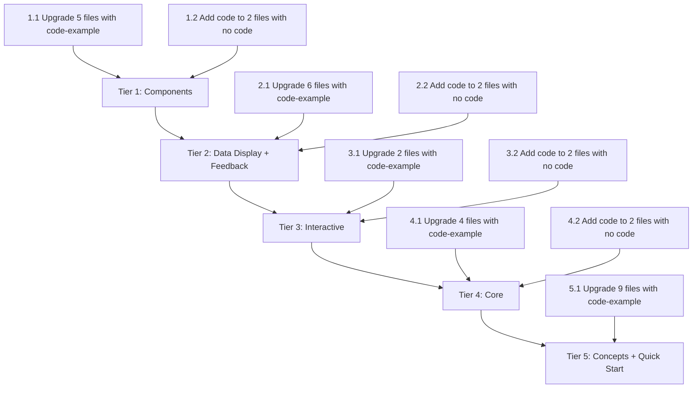

# Code Snippet Upgrade Plan

## Problem

The Vanduo documentation site has a **Code Snippet** component (`vd-code-snippet`) that provides collapsible, copyable, syntax-highlighted code blocks with language tabs. However, most documentation pages still use raw `<pre class="code-example"><code>` blocks instead of this component. Additionally, some pages have **no code examples at all** despite showing live demos.

## Solution

Replace all `<pre class="code-example">` blocks with the proper `vd-code-snippet` component, and add code snippets to demo-only pages that currently lack them.

---

## Audit Summary

### Code Display Approaches Found

| Approach | Class/Pattern | Features | Count |
|----------|--------------|----------|-------|
| **Raw code blocks** | `<pre class="code-example">` | Plain monospace text, no copy, no collapse, no tabs | **~69 instances** across ~25 files |
| **Vanduo Code Snippet** | `<div class="vd-code-snippet">` | Collapsible, copyable, syntax-highlighted, language tabs | **~10 files** (mostly guides) |
| **No code at all** | Demo-only content | Visual demos without any code reference | **~8 files** |

### Files Already Using `vd-code-snippet` ✅

These are done and need no changes:

| File | Status |
|------|--------|
| `sections/components/buttons.html` | ✅ Uses `vd-code-snippet` with `data-extract` |
| `sections/interactive/interactive.html` | ✅ Modal & Accordion have `vd-code-snippet` |
| `sections/feedback/alerts.html` | ✅ Uses `vd-code-snippet` |
| `sections/guides/getting-started-guide.html` | ✅ All code uses `vd-code-snippet` |
| `sections/guides/first-layout.html` | ✅ All code uses `vd-code-snippet` |
| `sections/guides/esm-vs-iife.html` | ✅ All code uses `vd-code-snippet` |
| `sections/guides/theme-customizer-guide.html` | ✅ All code uses `vd-code-snippet` |
| `sections/guides/accessibility-essentials.html` | ✅ All code uses `vd-code-snippet` |
| `sections/guides/fibonacci-vs-standard.html` | ✅ All code uses `vd-code-snippet` |

---

## Tier 1 — Components (Highest Priority)

These are the pages visible at `#docs/` > Components tab.

### 1.1 Upgrade `code-example` → `vd-code-snippet`

| # | File | Current State | Code Blocks | Action |
|---|------|--------------|-------------|--------|
| 1 | `sections/components/cards.html` | Mixed — 1 `code-example` for glow + 1 `vd-code-snippet` | 1 raw block | Convert the glow `code-example` to `vd-code-snippet` |
| 2 | `sections/components/footer.html` | 1 `code-example` | 1 raw block | Convert to `vd-code-snippet` |
| 3 | `sections/components/navbar.html` | 1 `code-example` | 1 raw block | Convert to `vd-code-snippet` |
| 4 | `sections/components/sidenav.html` | 1 `code-example` | 1 raw block | Convert to `vd-code-snippet` |
| 5 | `sections/components/theme-customizer.html` | 4 `code-example` blocks | 4 raw blocks | Convert all to `vd-code-snippet` |

### 1.2 Add Code Snippets (Currently No Code)

| # | File | Current State | Action |
|---|------|--------------|--------|
| 6 | `sections/components/forms.html` | Demo-only (inputs, checkboxes, radios, switches, validation) | Add `vd-code-snippet` blocks showing HTML markup for each form element group |
| 7 | `sections/components/navigation.html` | Demo-only (breadcrumbs, pagination) | Add `vd-code-snippet` blocks showing breadcrumb and pagination HTML |

---

## Tier 2 — Data Display & Feedback

### 2.1 Upgrade `code-example` → `vd-code-snippet`

| # | File | Code Blocks | Action |
|---|------|-------------|--------|
| 8 | `sections/data-display/avatars.html` | 1 raw block | Convert to `vd-code-snippet` |
| 9 | `sections/data-display/badges.html` | 1 raw block | Convert to `vd-code-snippet` |
| 10 | `sections/data-display/collections.html` | 1 raw block | Convert to `vd-code-snippet` |
| 11 | `sections/feedback/chips.html` | 1 raw block | Convert to `vd-code-snippet` |
| 12 | `sections/feedback/preloader.html` | 1 raw block | Convert to `vd-code-snippet` |
| 13 | `sections/feedback/skeleton.html` | 1 raw block | Convert to `vd-code-snippet` |

### 2.2 Add Code Snippets (Currently No Code)

| # | File | Current State | Action |
|---|------|--------------|--------|
| 14 | `sections/data-display/tables.html` | Demo-only (bordered, striped, hover tables) | Add `vd-code-snippet` showing table HTML for each variant |
| 15 | `sections/feedback/button-groups.html` | Demo-only (full-width, small, large groups) | Add `vd-code-snippet` showing button group HTML |

---

## Tier 3 — Interactive Components

### 3.1 Upgrade `code-example` → `vd-code-snippet`

| # | File | Code Blocks | Action |
|---|------|-------------|--------|
| 16 | `sections/interactive/search.html` | 5 raw blocks | Convert all to `vd-code-snippet` |
| 17 | `sections/interactive/code-snippet.html` | 2 raw blocks (the component documenting itself) | Convert to `vd-code-snippet` — dogfooding! |

### 3.2 Add Code Snippets (Currently No Code)

| # | File | Current State | Action |
|---|------|--------------|--------|
| 18 | `sections/interactive/tabs.html` | Demo-only (basic, boxed, pills tabs) | Add `vd-code-snippet` showing tab HTML for each variant |
| 19 | `sections/interactive/toasts.html` | Demo-only (toast types and options) | Add `vd-code-snippet` showing Toast JS API usage |

---

## Tier 4 — Core Sections

### 4.1 Upgrade `code-example` → `vd-code-snippet`

| # | File | Code Blocks | Action |
|---|------|-------------|--------|
| 20 | `sections/core/color-palette.html` | 2 raw blocks | Convert to `vd-code-snippet` |
| 21 | `sections/core/icons.html` | 3 raw blocks | Convert to `vd-code-snippet` |
| 22 | `sections/core/shadows-glow.html` | 2 raw blocks | Convert to `vd-code-snippet` |
| 23 | `sections/core/typography.html` | 3 raw blocks | Convert to `vd-code-snippet` |

### 4.2 Add Code Snippets (Currently No Code)

| # | File | Current State | Action |
|---|------|--------------|--------|
| 24 | `sections/core/golden-ratio.html` | Demo-only (golden split, Fibonacci cols, spacing scale, type scale) | Add `vd-code-snippet` showing grid class usage |
| 25 | `sections/core/grid-system.html` | Demo-only (containers, ordering, Fibonacci, gaps, toggle, offsets) | Add `vd-code-snippet` showing grid HTML patterns |

---

## Tier 5 — Concepts & Quick Start

### 5.1 Upgrade `code-example` → `vd-code-snippet`

| # | File | Code Blocks | Action |
|---|------|-------------|--------|
| 26 | `sections/concepts/breaking-changes.html` | 6 raw blocks | Convert to `vd-code-snippet` |
| 27 | `sections/concepts/lifecycle.html` | 2 raw blocks | Convert to `vd-code-snippet` |
| 28 | `sections/concepts/migration.html` | 6+ raw blocks | Convert to `vd-code-snippet` |
| 29 | `sections/concepts/modules.html` | 4 raw blocks | Convert to `vd-code-snippet` |
| 30 | `sections/concepts/namespacing.html` | 2 raw blocks | Convert to `vd-code-snippet` |
| 31 | `sections/concepts/token-reference.html` | 8 raw blocks | Convert to `vd-code-snippet` |
| 32 | `sections/concepts/tokens.html` | 2 raw blocks | Convert to `vd-code-snippet` |
| 33 | `sections/quick-start.html` | 6+ raw blocks | Convert to `vd-code-snippet` |
| 34 | `sections/media/image-box.html` | 4 raw blocks | Convert to `vd-code-snippet` |

---

## Implementation Pattern

Each `<pre class="code-example"><code>...</code></pre>` block should be replaced with the following pattern:

```text
BEFORE:

  <pre class="code-example"><code>...escaped HTML...</code></pre>

AFTER:

  <div class="vd-code-snippet" data-collapsible>
    <button class="vd-code-snippet-toggle" aria-expanded="false">
      <span class="vd-code-snippet-toggle-icon"></span>
      <span>View Code</span>
    </button>
    <div class="vd-code-snippet-content">
      <div class="vd-code-snippet-header">
        <div class="vd-code-snippet-tabs" role="tablist">
          <button class="vd-code-snippet-tab is-active" data-lang="html">HTML</button>
        </div>
        <button class="vd-code-snippet-copy" aria-label="Copy code">
          <span class="vd-code-snippet-copy-icon"></span>
          <span class="vd-code-snippet-copy-text">Copy</span>
        </button>
      </div>
      <div class="vd-code-snippet-body">
        <pre class="vd-code-snippet-pane is-active" data-lang="html"><code>...syntax-highlighted HTML...</code></pre>
      </div>
    </div>
  </div>
```

### Key Decisions

1. **Collapsible by default** — Use `data-collapsible` on all snippets so they start collapsed and don't overwhelm the page
2. **Language tabs** — Include relevant tabs: HTML-only for markup, HTML+CSS for styling examples, HTML+JS or JS-only for API examples
3. **Syntax highlighting** — Apply `<span class="code-tag">`, `code-attr`, `code-string`, `code-comment`, `code-selector`, `code-property`, `code-value`, `code-keyword`, `code-function` classes for color coding
4. **Copy button** — Every snippet gets a copy button
5. **`data-extract`** — Where practical, use `data-extract="#selector"` to auto-extract HTML from live demos instead of duplicating markup

---

## Execution Order



## Summary

| Category | Files to Upgrade | Files to Add Code | Total Files |
|----------|-----------------|-------------------|-------------|
| Components | 5 | 2 | 7 |
| Data Display + Feedback | 6 | 2 | 8 |
| Interactive | 2 | 2 | 4 |
| Core | 4 | 2 | 6 |
| Concepts + Quick Start | 9 | 0 | 9 |
| **Total** | **26** | **8** | **34** |

Total raw `code-example` blocks to convert: **~69**
Total new `vd-code-snippet` blocks to create for demo-only pages: **~20-25** (estimated)
